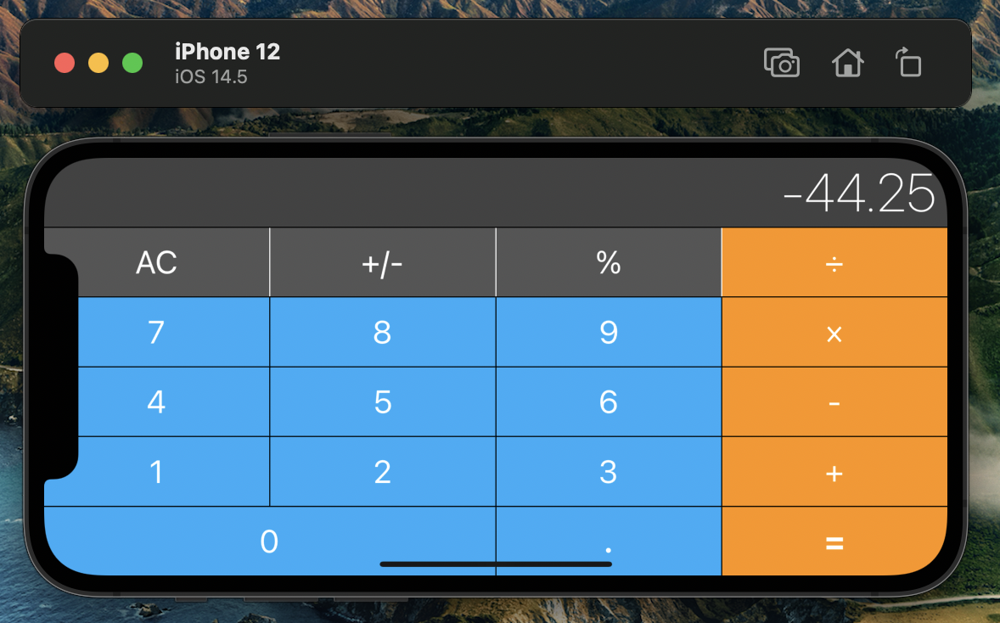

# iOS-Calculator

A simple replica of the default iOS calculator created with Swift 5.

Employs the Model-View-Controller and Delegation development patterns.

Works on any iPhone with iOS 13.0 or later installed.

